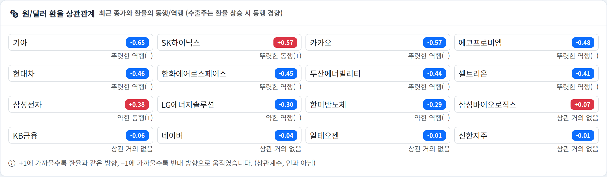
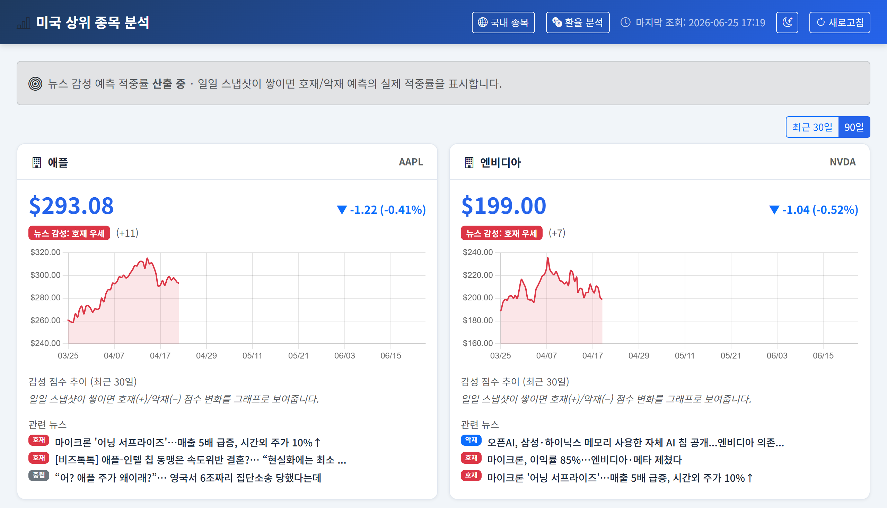

# Eco_Analysis — 원/달러 환율 · 국내/미국 주식 분석 대시보드

USD/KRW 환율과 국내·미국 시가총액 상위 종목을 함께 수집·시각화하고,
뉴스 감성·키워드를 분석해 **환율 변동의 원인을 추정**하고
**환율과 국내 주식의 상관관계를 분석**하는 Spring Boot 웹 애플리케이션입니다.

환율과 주식을 따로 보지 않고 한 화면에서 연결해, "원/달러가 움직일 때
어떤 종목이 같이(또는 반대로) 움직이는가", "종목 뉴스 호재/악재가 실제
주가 방향을 얼마나 맞히는가"까지 정량적으로 보여주는 것이 핵심입니다.

## 핵심 분석

- **🔗 환율 ↔ 국내 주식 상관 분석** — 종목별 일별 종가와 원/달러 환율을 같은 날짜로 정렬해 **피어슨 상관계수**를 산출하고, 동행(+)/역행(−) 강도를 한눈에 보여줍니다. 수출주(반도체 등)는 원화 약세(환율 상승) 국면에서 동행하는 경향을, 일부 내수·수입 의존 종목은 역행 경향을 보입니다. (상관관계이며 인과 단정은 아님)
- **📊 환율 변동 원인 추정** — 날짜별 환율 변동과 그 시점의 뉴스 키워드를 매핑해 "왜 움직였는지"를 추정하고, 뉴스 기반 압력 지수의 예측 방향이 실제 환율 방향과 얼마나 맞았는지 적중률로 누적 평가합니다.
- **🎯 종목 뉴스 감성 적중률** — 종목 뉴스의 호재/악재 감성으로 다음 거래일 방향을 예측하고, 실제 종가 방향과 비교해 적중률을 누적 평가합니다.



> 🔗 **환율↔종목 상관 분석 화면 예시.** 각 종목 종가와 원/달러 환율의 피어슨 상관계수를 동행(+, 빨강)·역행(−, 파랑)으로 표시합니다. 위 예시에서는 기아·현대차 등이 역행, SK하이닉스·삼성전자 등 반도체주가 동행 경향을 보입니다. (값은 조회 시점에 따라 달라집니다)

## 주요 기능

### 환율 분석

- **실시간 환율 조회** — Frankfurter API로 USD/KRW 환율을 가져옵니다 (API 키 불필요).
- **환율 히스토리 차트** — 최근 30일 환율을 일자별로 집계해 그래프로 표시합니다.
- **뉴스 키워드 분석** — 네이버 뉴스 검색 API에서 환율 관련 기사를 수집해 키워드 빈도를 분석합니다.
- **뉴스 아카이브** — 수집한 기사를 `link` 기준으로 중복 제거해 DB에 누적 저장합니다. API는 최근 기사만 주지만, 가동 기간이 길수록 부트스트랩·변동 원인·압력 지수 분석이 더 긴 히스토리를 활용합니다.
- **LLM 카테고리 분류 (선택)** — Google Gemini로 기사를 원인 카테고리로 분류해 키워드 부분문자열 매칭의 한계(부정문 오탐·문맥 무시)를 보완합니다. `GEMINI_API_KEY`가 없으면 자동으로 키워드 매칭으로 폴백합니다.
- **변동 원인 분석** — 날짜별 환율 변동과 그 시점의 뉴스 키워드를 매핑해 변동 원인을 추정합니다.
- **압력 지수 / 적중률** — 뉴스 기반 환율 압력 지수를 산출하고, 일별 스냅샷으로 예측 적중률을 누적 평가합니다.

### 국내·미국 주식 분석 (`/stocks`, `/stocks/us`)

- **상위 종목 시세·차트** — 국내(`/stocks`, 원화)와 미국(`/stocks/us`, 달러) 각각 시가총액 상위 10개 종목의 일별 시세(Yahoo Finance, 무인증)와 30/90일 종가 차트, 전일 대비 변동액·변동률·상승/하락 방향을 보여줍니다. 상단 버튼으로 두 시장을 전환합니다.
- **뉴스 호재/악재 감성** — 종목별 종합 감성에 더해 **개별 뉴스마다 호재(빨강)·악재(파랑)·중립(회색) 배지**를 제목 앞에 붙여 영향 방향을 한눈에 볼 수 있습니다. 미국 종목은 네이버 한국어 뉴스(예: "애플", "엔비디아")를 검색해 동일한 감성 로직을 적용합니다.
- **원/달러 환율 상관** — 각 종목과 환율의 상관계수·동행/역행 강도를 표시합니다 (국내 페이지 한정, 위 *핵심 분석* 참고).
- **감성 예측 적중률** — 매일 종목별 감성·예측 방향·종가를 스냅샷으로 남기고, 이후 거래일 종가 방향과 비교해 호재/악재 예측의 누적 적중률을 평가합니다.
- **감성 점수 추이** — 일별 스냅샷의 감성 점수를 시계열 미니 차트로 보여줘 호재/악재 흐름의 변화를 추적합니다.
- **급변/악재 주의 강조** — 전일 대비 ±3% 이상 급변하거나 악재 우세인 종목 카드를 테두리·배지로 강조해 주의 종목을 한눈에 식별합니다.



> 📈 **미국 종목 페이지(`/stocks/us`) 화면 예시.** 달러($) 시세·전일 대비 변동, 종목별 뉴스 감성과 호재/악재 배지를 국내와 동일한 형식으로 보여줍니다. 상단 버튼으로 국내↔미국을 전환합니다. (미국 종목 뉴스는 네이버 한국어 뉴스를 관련도순으로 검색)

### 공통

- **자동 갱신** — 앱 시작 시 과거 데이터를 백필하고, 매 1시간마다 환율·스냅샷(환율·종목)을 갱신합니다.
- **장애 대응** — 외부 API 응답 지연 시 DB의 마지막 저장값으로 폴백하고 안내 문구를 노출합니다.

## 기술 스택

| 영역 | 사용 기술 |
|------|-----------|
| 언어 / 런타임 | Java 21 |
| 프레임워크 | Spring Boot 3.3.5 (Web, JPA, Thymeleaf, Validation, Cache, Actuator) |
| 데이터베이스 | H2 (파일 모드, `./data/ecoanalysis.mv.db`) |
| 캐시 | Caffeine (5분 TTL) |
| 빌드 | Gradle (Wrapper 포함) |
| 외부 API | [Frankfurter](https://api.frankfurter.app) (환율), 네이버 뉴스 검색 API, [Yahoo Finance](https://finance.yahoo.com) (국내 종목 시세, 무인증), [Google Gemini](https://ai.google.dev) (선택, 뉴스 분류) |
| 배포 | Docker / Docker Compose, GitHub Actions (CI·CD), GHCR |

## 시작하기

### 사전 준비

- JDK 21
- 네이버 검색 API 키 ([네이버 개발자 센터](https://developers.naver.com)에서 발급)
- (선택) Google Gemini API 키 ([Google AI Studio](https://aistudio.google.com)에서 발급) — 뉴스 LLM 분류용. 없으면 키워드 매칭으로 동작합니다.

### 1. 네이버 API 키 설정

`src/main/resources/application-local.properties` 에 실제 키를 입력하거나,
환경변수로 주입합니다.

```properties
api.naver.client-id=YOUR_NAVER_CLIENT_ID
api.naver.client-secret=YOUR_NAVER_CLIENT_SECRET
```

```bash
# 또는 환경변수로
export NAVER_CLIENT_ID=xxxx
export NAVER_CLIENT_SECRET=xxxx

# (선택) Gemini 뉴스 분류 활성화 — 미설정 시 키워드 매칭 폴백
export GEMINI_API_KEY=xxxx
# 기본 모델은 gemini-2.5-flash (무료 등급에서 동작).
# gemini-2.5-pro는 결제(billing) 활성화가 필요하다 — 무료 등급 한도가 0.
# export GEMINI_MODEL=gemini-2.5-pro
```

### 2. 로컬 실행

```bash
./gradlew bootRun
```

브라우저에서 http://localhost:8080 으로 접속합니다.

- H2 콘솔: http://localhost:8080/h2-console (local 프로필에서만 활성)
  - JDBC URL: `jdbc:h2:file:./data/ecoanalysis`, 사용자: `sa`, 비밀번호 없음
- 헬스 체크: http://localhost:8080/actuator/health

### 3. 테스트

```bash
./gradlew test
```

## API 엔드포인트

| 메서드 | 경로 | 설명 |
|--------|------|------|
| `GET` | `/` | 대시보드 (Thymeleaf 렌더링) |
| `GET` | `/api/rate/current` | 현재 USD/KRW 환율 |
| `GET` | `/api/rate/history?days=30` | 일자별 환율 히스토리 (1~365일) |
| `GET` | `/api/analysis` | 키워드 분석 + 변동 원인 + 압력 지수/적중률 |
| `GET` | `/stocks` | 국내 상위 종목 분석 페이지 (Thymeleaf) |
| `GET` | `/stocks/us` | 미국 상위 종목 분석 페이지 (Thymeleaf) |
| `GET` | `/api/stocks` | 국내 상위 10개 종목 시세 + 뉴스 감성 (JSON) |
| `GET` | `/api/stocks/us` | 미국 상위 10개 종목 시세 + 뉴스 감성 (JSON) |

## Docker로 실행

```bash
export NAVER_CLIENT_ID=xxxx
export NAVER_CLIENT_SECRET=xxxx

docker compose up -d --build
curl http://localhost:8080/actuator/health   # {"status":"UP"}
```

데이터(H2 파일)는 `app-data` 볼륨에 영속됩니다.

## 배포 (CI·CD)

- **CI** (`.github/workflows/ci.yml`): PR → main 시 Gradle 빌드·테스트
- **CD** (`.github/workflows/cd.yml`): push → main 시 빌드·테스트 → Docker 이미지 빌드 → GHCR 푸시 → (옵션) SSH 배포

자세한 배포 설정(시크릿·변수, 서버 준비, 자동 배포 활성화)은 [DEPLOY.md](DEPLOY.md)를 참고하세요.

### 운영 환경

- **이미지**: `ghcr.io/junse02/wontodollaranalysis:latest` (+ 커밋 SHA 태그)
- **실행 형태**: 배포 서버에서 `docker compose`로 `prod` 프로필 컨테이너 1개 구동, H2 데이터는 `app-data` 볼륨에 영속
- **접속**: 도메인 없이 배포 서버 IP로 접속 — `http://<배포서버 IP>:8080`
  - 헬스 체크: `http://<배포서버 IP>:8080/actuator/health` → `{"status":"UP"}`
- **배포 반영**: `main` 푸시 시 CD가 새 이미지를 GHCR에 푸시하고, 서버에서 `docker compose pull && up -d`로 자동 교체 (`DEPLOY_ENABLED=true`인 경우)

## 프로필

| 프로필 | 용도 | 특징 |
|--------|------|------|
| `local` (기본) | 로컬 개발 | H2 콘솔 활성, 실제 키는 `application-local.properties` |
| `prod` | 운영 (Docker) | H2 콘솔 비활성, Actuator 헬스만 노출 |

## 프로젝트 구조

```
src/main/java/sung/eco_analysis/
├── config/        # API 설정 프로퍼티, RestClient 등 빈 구성
├── controller/    # 웹(Thymeleaf) / REST API / 전역 예외 처리
├── dto/           # 외부 API 응답 및 분석 결과 DTO
├── entity/        # RateHistory, DailySnapshot, NewsArticle (JPA)
├── repository/    # Spring Data JPA 리포지토리
├── scheduler/     # 환율·스냅샷 자동 갱신 스케줄러
└── service/       # 환율 조회, 뉴스 수집·아카이브·LLM 분류, 키워드 분석, 스냅샷 평가
```